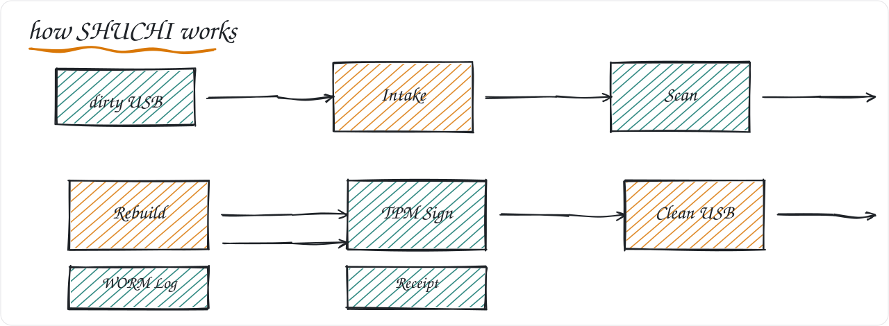

# SHUCHI

Open-source air-gapped USB sanitisation kiosk. Maya OS native. Deterministic CDR with TPM 2.0 audit trail. For the iDEX Open Challenge.



## Quick start

```bash
git clone https://github.com/mastaan66/shuchi
cd shuchi
./scripts/install_maya.sh
source venv/bin/activate
npm run dev
```

Or use the CLI: `python src/pipeline/main.py --dirty /media/dirty --clean /media/clean`

Hardware for the demo: N100 mini-PC with TPM 2.0, 8GB RAM, 256GB SSD, USBGuard, receipt printer. About Rs. 35,000.

## How it works

A kiosk sits at the air gap. The dirty USB never touches the clean side. Only a rebuilt clean copy crosses.

1. **Intake.** USBGuard blocks writing. The drive mounts read-only. libmagic checks the true file type to catch wrong extensions and polyglot files. Unsupported files are blocked and logged.

2. **Scan.** ClamAV scans offline with CVD files. YARA runs 30 rules. oletools checks Office macros. No internet is used. Each file gets a per-file verdict.

3. **Rebuild.** The file is opened and saved again from content only. qpdf handles PDFs, Pillow handles images, python-docx/python-pptx/openpyxl handle Office files. Hidden code and exploits are left behind. Hindi and Office formatting is preserved.

4. **Handover.** The clean file goes on a clean USB. TPM 2.0 signs the receipt. A hash-chain WORM log records every step. The dirty drive is wiped with DoD 3-pass.

## What it is different

| Point | Imports / Matisoft | SHUCHI |
|-------|-------------------|--------|
| Where it is used | Heavy SOC suite for central control | Light kiosk for any room |
| Can it be checked | No, closed | Yes, full code open |
| Maya OS / Internet | No / Needs cloud | Yes / No internet needed |
| Record | Can be edited | Cannot be changed (TPM + hash chain) |
| Cost per unit | Rs. 12 to 15 lakh + yearly fee | Rs. 35,000 |

SHUCHI is for the edge. Matisoft is for central policy. They complement. The need is 5000+ units (2 to 3 per establishment).

## Stack

| Part | Tools |
|------|-------|
| Platform | Maya OS, Electron + Python, N100 mini-PC with TPM 2.0, receipt printer |
| Intake | USBGuard, udisks read-only mount, libmagic |
| Scan | ClamAV offline, YARA 300, oletools (olevba, msodde, mraptor) |
| Rebuild (CDR) | qpdf, exiftool, Pillow, LibreOffice headless |
| Trust | tpm2-tools (TPM 2.0 quote), hash-chain WORM log, PDF receipt |

All parts are open-source (GPL-3.0). Build can be made again for audit. No hidden binary. No cloud. No licence fee.

## Test

The corpus has 130 files: 40 clean (including 10 Hindi Office files), 30 infected (EICAR and macro samples), 30 malformed (polyglot, wrong extension), 30 mixed.

```bash
./scripts/eicar_test.sh
python src/pipeline/main.py --dirty tests/corpus --clean /media/clean
```

Target is no silent failure and correct Hindi preservation.

## Repo layout

```
shuchi/
  README.md           -- this file
  ARCHITECTURE.md     -- pipeline, threat model, and air-gap design
  BUILD.md            -- how to build on Maya OS
  TESTING.md          -- 130-file corpus and test steps
  ROADMAP.md          -- 15-day demo and 180-day pilot
  LICENSE             -- GPL-3.0
  src/
    pipeline/         -- verify, detect, rebuild
    cdr/              -- qpdf, exiftool, Pillow, LibreOffice wrappers
    audit/            -- TPM quote, WORM log, PDF receipt
  rules/yara/         -- 30 YARA rules
  scripts/            -- install and test scripts
  tests/corpus/       -- 130 files (clean, infected, malformed, Hindi)
  hardware/           -- N100 + TPM + printer wiring
  docs/               -- DGQA audit notes, SOP
```

## Plan

15-day demo sprint for the iDEX Open Challenge (due 30 Sep 2026):

| Phase | What | When |
|-------|------|------|
| D1 to D2 | Rig and test, Maya VM, USBGuard, EICAR | Day 1 to 2 |
| D3 to D6 | Core build, 5 file types | Day 3 to 6 |
| D7 to D9 | TPM log, Electron UI, Hindi check | Day 7 to 9 |
| D10 to D11 | Corpus test, 2-minute video | Day 10 to 11 |
| D12 to D15 | Paper and video submission | Day 12 to 15 |

Post-grant, 180 days to 10-kiosk trial: M1 design 30 days (10%), M2 15 formats 60 days (20%), M3 hardening 90 days (20%), M4 trials at Navy and IAF 120 days (25%), M5 DGQA papers 150 days (15%), M6 trial of 10 kiosks 180 days (10%).

## DGQA and audit

All code is GPL-3.0 and can be checked. Build can be made again. No hidden binary. TPM 2.0 quote and hash-chain log provide a record that cannot be changed. Monthly signed offline pack updates signatures without internet.

## License

GPL-3.0. See LICENSE.
